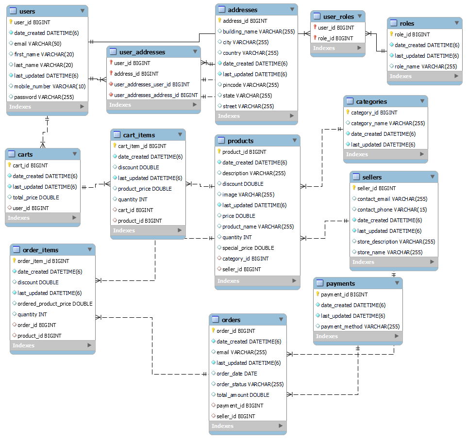

# QuickCart 

## Overview
This project is a database schema for an E-Commerce platform that includes users, products, orders, payments, and other essential entities required for online shopping. The schema is designed to handle user accounts, shopping carts, product categories, sellers, and order processing.

## ER Diagram



## Database Schema

The database schema consists of the following tables:

### 1. **Users (`users`)**
- Stores user details such as name, email, and contact information.
- Related to `user_addresses` for managing multiple addresses.

### 2. **Addresses (`addresses`)**
- Stores address details such as street, city, and country.
- Connected to `user_addresses` for mapping users to addresses.

### 3. **User Roles (`user_roles` and `roles`)**
- Implements role-based access control.
- Stores different roles such as `admin`, `customer`, and `seller`.

### 4. **Products (`products`)**
- Stores product information including name, price, description, and images.
- Related to `categories` and `sellers`.

### 5. **Categories (`categories`)**
- Organizes products into different categories.

### 6. **Sellers (`sellers`)**
- Stores seller information such as store name and contact details.
- Linked with `products` to associate sellers with their products.

### 7. **Shopping Cart (`carts` and `cart_items`)**
- Allows users to add products to their cart before checkout.

### 8. **Orders (`orders` and `order_items`)**
- Manages order details and tracks purchased items.
- Related to `payments` for transaction processing.

### 9. **Payments (`payments`)**
- Stores payment details, including payment method and status.

## Features
- User authentication and role-based access control.
- Product listing and categorization.
- Shopping cart functionality.
- Order and payment processing.
- Seller management and product association.

## Setup Instructions
1. Clone the repository:
   ```sh
   git clone <repository-url>
   cd e-commerce-project
   ```
2. Import the database schema into MySQL:
   ```sh
   mysql -u root -p < database_schema.sql
   ```
3. Configure the database connection in your application.
4. Run the application and start using the platform.

## Future Enhancements
- Implement RESTful APIs for frontend integration.
- Add discount and coupon management.
- Improve reporting and analytics for orders and sales.
- Optimize performance with indexing and caching.

## Contribution
Feel free to contribute by submitting issues and pull requests to enhance the system.

---
**Author:** Ayush Kumar  
**License:** MIT  
**Version:** 1.0.0

